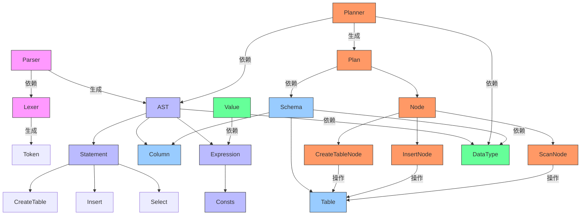

## 支持的SQL

### 1\ Create Table
``` sql
CREATE TABLE table_name (
    [ column_name data_type [column_constraint [...] ]]
    [, ...]
);

where data_type is
    - BOOLEAN(BOOL): true | false
    - FLOAT(DOUBLE)
    - INTEGER(INT)
    - STRING(TEXT, VARCHAR)

where column_constraint is:
    [NOT NULL | NULL | DEFAULT expr ]
```

### 2\ Insert Data
``` sql
INSERT INTO table_name
[ ( column_name [,...] ) ]
values (expr [,...]);
```

### 3\ Query Data
``` sql
SELECT [ * | column_name [ [ AS ] output_name [, ...]] ]
FROM table_name;
[ORDER BY col_name [asc | desc] [, ...]]
[LIMIT count]
[OFFSET count]
```


### 4\ Update Data
``` sql
UPDATE table_name
SET column_name = expr [, ...]
[WHERE condition]
```
where condition is: `column_name = expr`


### 5\ Delete Data
``` sql
DELETE FROM table_name
[WHERE condition];
```

where condition is: `column_name = expr`

## 数据模型

以下是模块依赖关系图，展示了各个模块之间的依赖关系：



### 关键依赖关系说明：

1. **自底向上解析流程**：
   ```
   Lexer → Parser → AST → Planner → Plan
   ```

2. **核心跨模块依赖**：
   - `AST` 依赖 `DataType`（类型定义）
   - `Planner` 同时依赖 `AST` 和 `DataType`
   - `Plan` 的执行节点依赖 `Schema` 操作表结构

3. **数据转换关系**：
   - `Value` 从 `Expression` 转换而来（`from_expression`）
   - `Schema::Column` 由 `AST::Column` 转换而来

4. **执行操作关系**：
   - 所有 Plan Node 最终都操作 `Table` 结构
   - `InsertNode` 额外依赖 `Value` 处理数据


