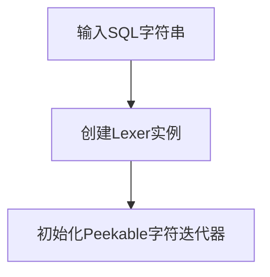
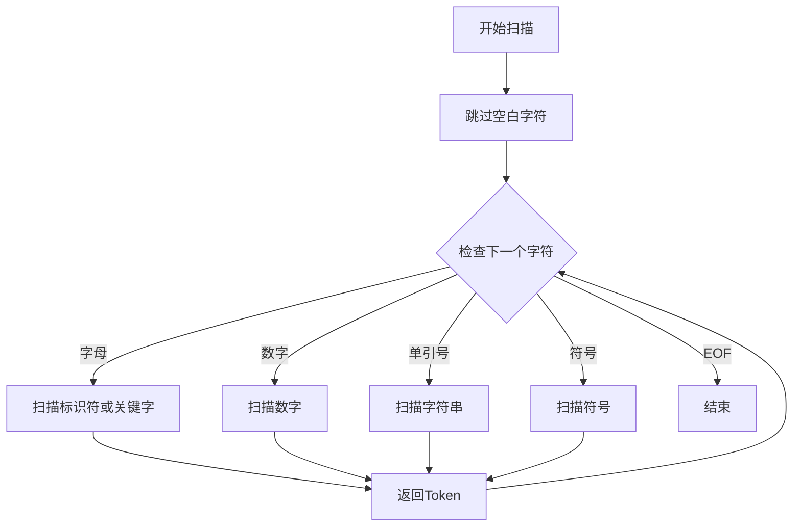
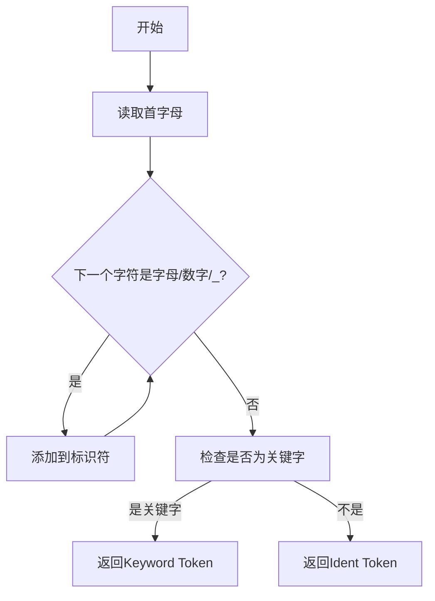

# SQL Lexer 实现文档

## 概述

这是一个用 Rust 实现的 SQL 词法分析器(Lexer)，能够将 SQL 语句分解为一系列 Token，为后续的语法分析做准备。

## 核心功能

- 识别 SQL 关键字 (CREATE, SELECT, INSERT 等)
- 识别标识符 (表名、列名)
- 识别字符串和数字字面量
- 识别各种符号 (括号、逗号、分号等)

## 主要对象

### 1. Keyword 枚举


```rust
#[derive(Debug, Clone, PartialEq)]
pub enum Keyword {
    Create, Table, Int, Integer, Boolean, Bool, 
    String, Text, Varchar, Float, Double,
    Select, From, Insert, Into, Values,
    True, False, Default, Not, Null,
    Primary, Key,
}
```

- 包含所有支持的 SQL 关键字
- 提供 `from_str` 和 `to_str` 方法进行字符串转换

### 2. Token 枚举


```rust
#[derive(Debug, Clone, PartialEq)]
pub enum Token {
    Keyword(Keyword),    // 关键字
    Ident(String),       // 标识符
    String(String),      // 字符串
    Number(String),      // 数字
    OpenParen,          // (
    CloseParen,         // )
    Comma,              // ,
    Semicolon,          // ;
    Asterisk,           // *
    Plus,               // +
    Minus,              // -
    Slash,              // /
}
```

- 表示词法分析后得到的各种 Token 类型
- 实现了 Display trait 用于格式化输出

### 3. Lexer 结构体


```rust
pub struct Lexer<'a> {
    iter: Peekable<Chars<'a>>,
}
```

- 核心词法分析器
- 实现了 Iterator trait，可以逐个产生 Token
- 内部使用 Peekable<Chars> 来遍历输入字符串

## 主要流程

### 1. 初始化



### 2. Token 扫描流程



### 3. 标识符扫描流程



## 示例

### 输入 SQL

```sql
CREATE TABLE users (
    id INT PRIMARY KEY,
    name VARCHAR DEFAULT 'anonymous',
    age INT
);
```

### 输出 Token 序列

1. `Keyword(Create)`
2. `Keyword(Table)`
3. `Ident("users")`
4. `OpenParen`
5. `Ident("id")`
6. `Keyword(Int)`
7. `Keyword(Primary)`
8. `Keyword(Key)`
9. `Comma`
10. `Ident("name")`
11. `Keyword(Varchar)`
12. `Keyword(Default)`
13. `String("anonymous")`
14. `Comma`
15. `Ident("age")`
16. `Keyword(Int)`
17. `CloseParen`
18. `Semicolon`

## 测试用例

代码中包含多个测试用例，覆盖了:

1. CREATE TABLE 语句
2. INSERT 语句
3. SELECT 语句
4. 各种数据类型和约束
5. 复杂表结构定义

可以通过 `cargo test` 运行所有测试。

## 扩展性

可以轻松扩展以支持更多 SQL 语法:

1. 在 `Keyword` 枚举中添加新的关键字
2. 在 `Token` 枚举中添加新的 Token 类型
3. 在 `scan_symbol` 中添加新的符号支持